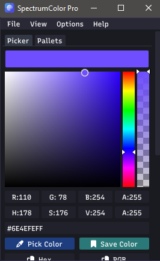
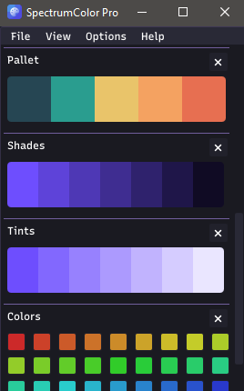
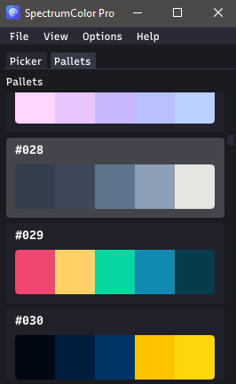
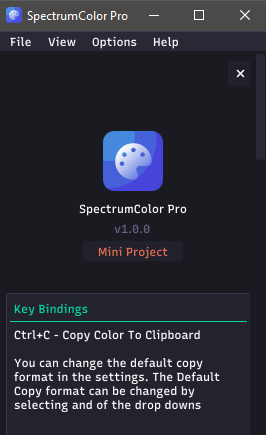
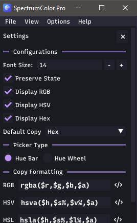

# SpectrumColor Pro🍀
SpectrumColor Pro is a powerful and user-friendly color picker designed to enhance your color selection experience on the Windows desktop. This feature-rich application empowers users to seamlessly capture colors from their screen, fine-tune shades using an intuitive hue bar, and conveniently save their customized colors for later use.

### Introducing "SpectrumColor Pro" Color Picker for Windows Desktop

SpectrumColor Pro is a powerful and user-friendly color picker designed to enhance your color selection experience on the Windows desktop. This feature-rich application empowers users to seamlessly:

- **Screen Color Capture**: Instantly extract colors from any screen location, perfect for matching existing designs.
- **Hue Bar Customization**: Adjust shades with precision using an intuitive hue bar for harmonious color schemes.
- **Predefined Color Palettes**: Explore diverse preloaded palettes for captivating combinations.
- **User-Defined Copy Format**: Copy colors in formats like RGBA, HEX, HSLA, HSV for compatibility.
- **Elegant Dark UI**: Enjoy an eye-friendly, distraction-free dark interface.
- **Intuitive Commands**: User-friendly controls for a seamless experience.

SpectrumColor Pro offers powerful tools, a variety of presets, and an elegant dark UI, providing an exceptional color selection and modification experience for designers and enthusiasts alike.